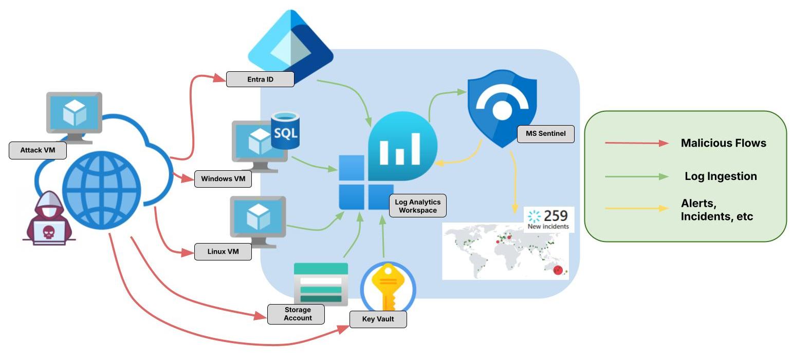
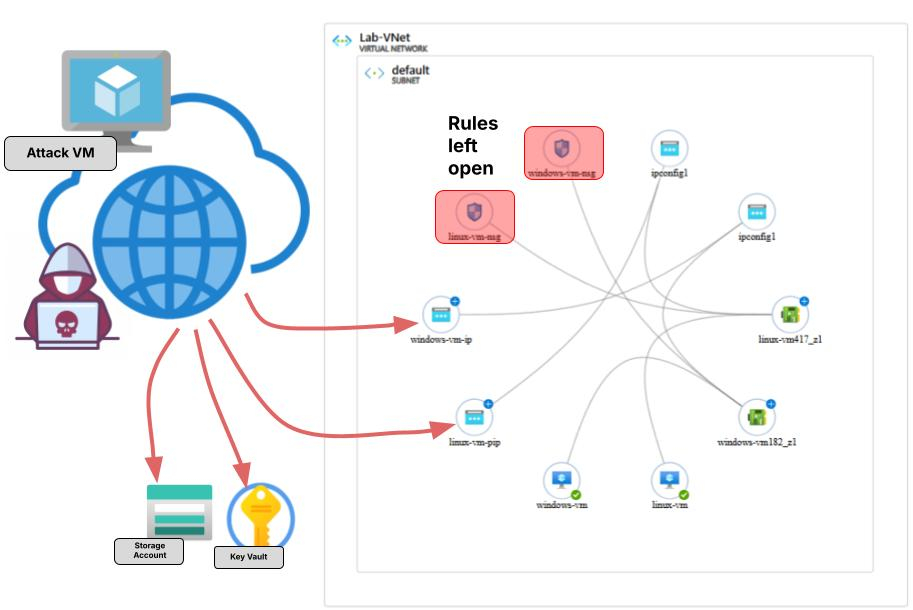
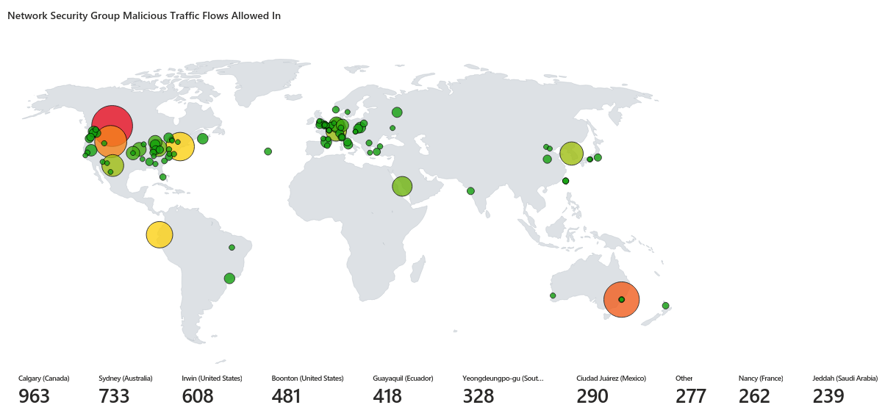
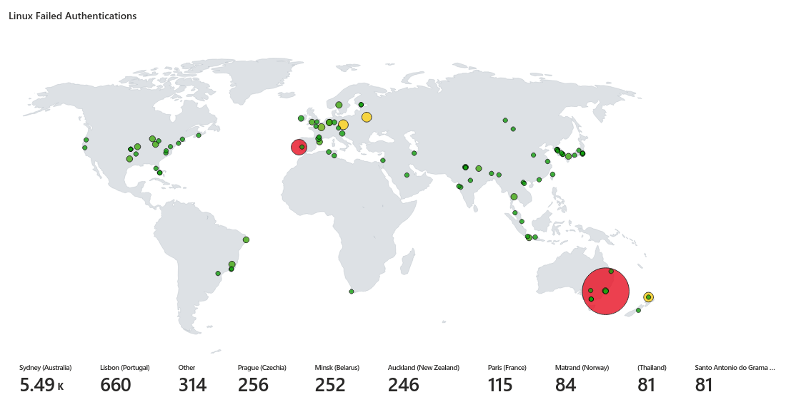
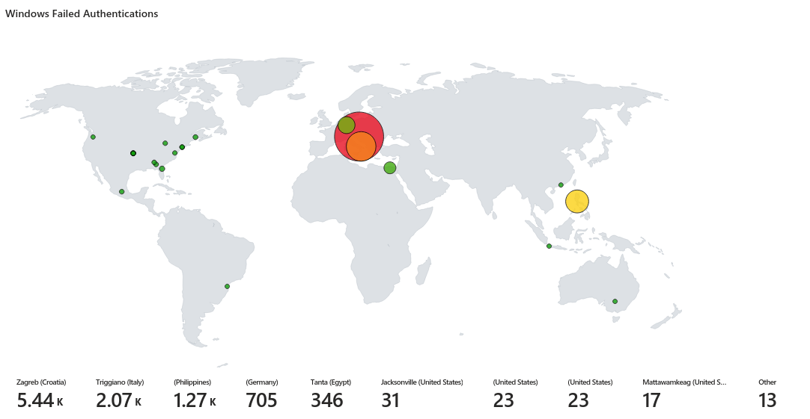
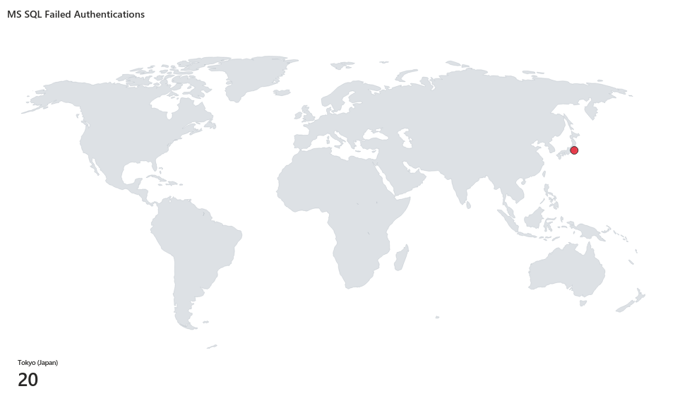
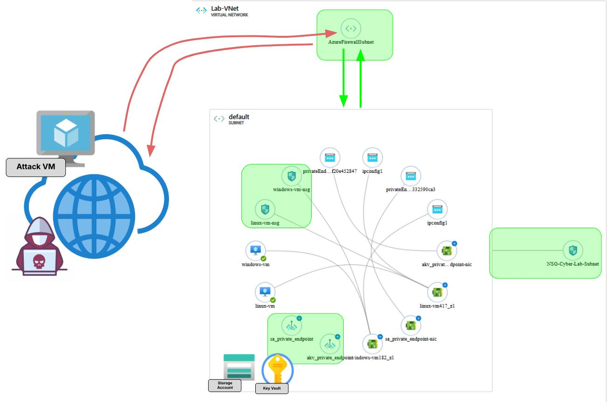
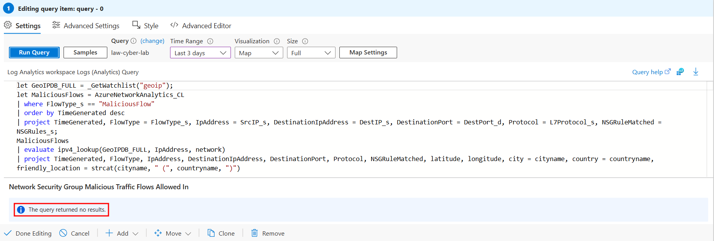

# Azure Honeynet SIEM Project

## Project Overview
This project leverages Azure to deploy vulnerable resources, ingest logs, and utilizes Azure Sentinel as a SIEM. Open network security groups on provisioned Linux and Windows VMs attract attacker activity for logging. Additional resources like Storage Accounts and Azure Key Vaults were also created for log generation. Logs were ingested into a Log Analytics Workspace and analyzed in Azure Sentinel to build workbooks, alerts, attack maps, and incidents. Key log sources include:

- **SecurityEvent** (Windows Event Logs)
- **Syslog** (Linux Event Logs)
- **SecurityAlert** (Log Analytics Alerts)
- **SecurityIncident** (Sentinel-Generated Incidents)
- **AzureNetworkAnalytics_CL** (Malicious Allowed Flows)

**Overview of the project setup:**

## Unsecure Network Architecture / Environment 
In its unsecure state, Azure resources were fully exposed to the public internet. Network Security Groups allowed access to all ports on both Linux and Windows machines, host-based firewalls were disabled, and no security groups were applied at the virtual network level. Azure Firewalls were not implemented, and resources like Azure Key Vault and Storage Account used public endpoints, permitting unrestricted access.

**Deployed resources for the Azure honeynet:**
- Virtual Network (VNet)
- Network Security Group (NSG)
- Virtual Machines (2 Windows, 1 Linux)
- Log Analytics Workspace
- Azure Key Vault
- Azure Storage Account
- Microsoft Sentinel

## Attack Maps Before Implementation of Security Controls
The unsecured environment was run for 72 hours and a Microsoft Sentinel workbook was used to generate the following attack maps:
 
 
 
This last map displaying failed logins against the SQL Database only shows a single location in Japan. This was an attack machine which was provisioned in Tokyo and used to simulate a brute force against the database.
 
## Metrics Before Implementation of Security Controls

The following metrics were collected after running the unsecure environment for 72 hours:

| Metric                   | Count
| ------------------------ | -----
| SecurityEvent            | 347449
| Syslog                   | 25647
| SecurityIncident         | 858
| AzureNetworkAnalytics_CL | 6770

## Network Architecture / Environment After Implementation of Security Controls
The environment was secured by enforcing network security rules at both the host and subnet levels, enabling host-based firewalls, deploying an Azure Firewall, and using private endpoints for Storage Account and Key Vault access. VM access was restricted to a single management IP, with all traffic routed through the Azure Firewall. Private endpoints ensured only virtual network machines could reach Key Vault and Storage. Additionally, Microsoft Defender for Cloud was configured to assess compliance with NIST 800-53, and security controls were applied accordingly.

## Attack Maps After Implementation of Security Controls
Map queries did not return results due to lack of malicious activity for the 72 hour period after securing the environment

## Metrics After After Implementation of Security Controls

The following table shows the metrics measured in the environment, which was left running for 72 hours, after having applied security controls. 

| Metric                   | Count
| ------------------------ | -----
| SecurityEvent            | 457
| Syslog                   | 346
| SecurityIncident         | 0
| AzureNetworkAnalytics_CL | 0

## Conclusion
This project involved creating a honeynet within an Azure environment to attract and analyze malicious activity using Azure Sentinel as a SIEM. By deploying vulnerable virtual machines, storage accounts, and key vaults with open network security groups, the environment collected attack data over 72 hours. Logs from Windows Event Viewer, Linux Syslog, and Azure Network Analytics were ingested into a Log Analytics Workspace and visualized through Sentinel workbooks, attack maps, and incident reports. After implementing security controls—such as firewalls, private endpoints, and restricted access rules—malicious activity dropped to zero, demonstrating the effectiveness of proactive cloud security measures.

The following table summarizes the % change in each log count after implementing the security controls:

| Metric                   | % Change After Securing Environment
| ------------------------ | -----
| SecurityEvent            | -99.87%
| Syslog                   | -98.65%
| SecurityIncident         | -100.00%
| AzureNetworkAnalytics_CL | -100.00%

## Additional Writeups Within This Lab
- [Simulating and Working a Linux Brute Force Incident in Azure SIEM (NIST 800-61)]()
- [Deploying and Configuring an Azure Firewall to Protect a Virtual Network]()